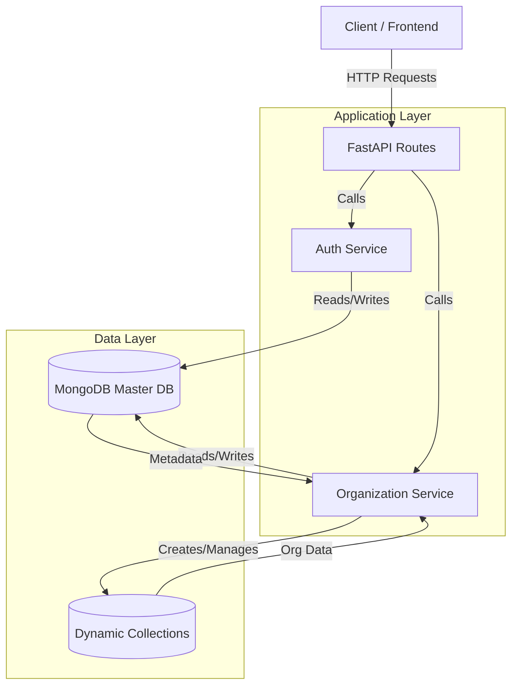

# System Design & Architecture

## Architecture Overview

The system follows a **Service-Repository** pattern (simplified here as Service-Database) using **FastAPI**.

### High-Level Diagram

## Design Choices

### 1. Multi-Tenancy Strategy
**Approach**: **Database-per-Organization** (simulated via **Collections**).
- **Why**: The requirement specified creating a "new Mongo collection" for each organization.
- **Implementation**:
    - **Master Database (`master_db`)**: Stores global metadata (`organizations` collection) and admin credentials (`admins` collection).
    - **Tenant Data**: Stored in dynamic collections named `org_<organization_name>`.
    - **Scalability**: MongoDB handles large numbers of collections well. For valid scale, we could easily switch to `get_database(f"org_{name}")` to use separate databases instead of collections with minimal code change in `database.py`.

### 2. Authentication & Security
- **JWT (JSON Web Tokens)**: Stateless authentication. The token contains the Admin's identity (email) and their scope (Organization Name).
- **Bcrypt**: Industry-standard password hashing.
- **Role**: Currently single role (Admin), scoped to one organization.

### 3. Service Layer Pattern
- **Refactoring**: Logic was moved from `routes` to `services`.
- **Reason**:
    - **Separation of Concerns**: Routes handle HTTP (request parsing, status codes). Services handle Business Logic (validation, DB operations).
    - **Reusability**: Services can be called by other parts of the app or CLI scripts.
    - **Testability**: Services can be unit tested independently of the HTTP layer.

### 4. Dynamic Updates (Renaming)
- **Challenge**: Renaming an organization requires updating the metadata AND the underlying storage.
- **Solution**: MongoDB's `rename` collection feature is used to atomically rename the tenant collection, ensuring data consistency with the new name.
